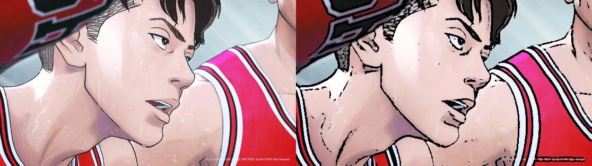
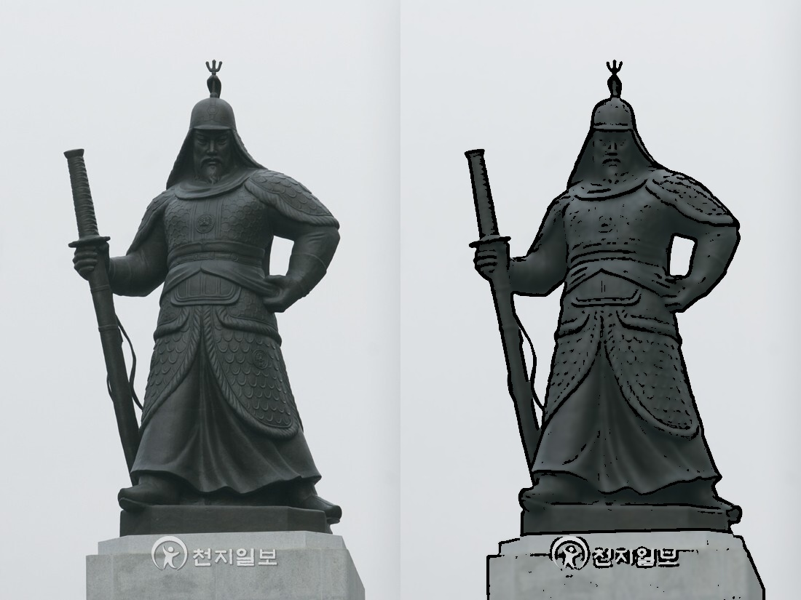
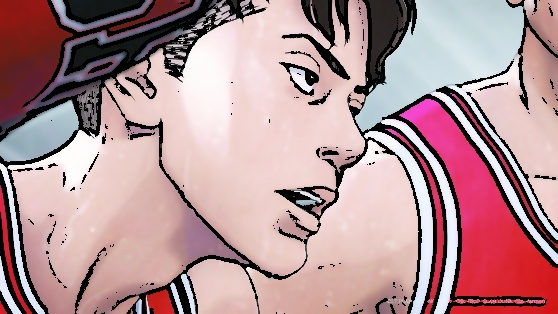

# OpenCV-cartoon-renderer
Cartoon image rendering using OpenCV

본 프로젝트는 OpenCV를 이용하여 입력 이미지를 만화(cartoon) 스타일로 변환하는 프로그램이다.

## 설명
이미지 처리 기법을 활용하여 일반 이미지를 만화 스타일로 변환하는 것을 목표로 한다.

사용된 주요 기법:
- Bilateral Filter를 이용한 색상 부드럽게 처리
- Adaptive Threshold를 이용한 윤곽선 추출
- 색상 이미지와 윤곽선을 결합하여 만화 효과 생성

## 실행 방법

    python main.py

입력 이미지 파일(`slamdunk22.jpg`, `bad.jpg`)은 코드와 같은 폴더에 있어야 한다.

## 결과

### ✔ 잘 표현된 이미지

이 이미지는 윤곽선이 뚜렷하고 색상이 비교적 단순하여 만화 스타일이 잘 표현되었다.  
윤곽선이 강조되고 색상 영역이 부드럽게 유지되면서 전체적으로 만화 같은 효과가 잘 나타난다.

### 잘 표현되지 않은 이미지

이 이미지는 동상 사진으로, 색 변화가 크지 않고 표면의 미세한 질감이 많이 포함되어 있다.  
그 결과 불필요한 디테일이 윤곽선으로 검출되어 이미지가 지저분해 보이며, 깔끔한 만화 느낌이 잘 나타나지 않는다.  
전체적으로 만화 스타일이라기보다는 단순한 엣지 강조 이미지에 가깝다.

## 한계점
- 복잡한 배경에서 불필요한 윤곽선이 많이 생성됨
- 머리카락, 나뭇잎 등 미세한 디테일 표현이 부자연스러움
- 색상 단순화가 완벽하지 않아 만화 느낌이 약해질 수 있음
- 이미지마다 적절한 파라미터 설정이 필요함

## 알고리즘
1. 입력 이미지를 그레이스케일로 변환
2. Median Blur를 적용하여 노이즈 제거
3. Adaptive Threshold를 이용해 윤곽선 추출
4. Bilateral Filter를 이용해 색상 부드럽게 처리
5. 윤곽선과 색상 이미지를 결합하여 최종 결과 생성

## 결과 이미지

